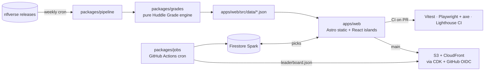

# Motown Huddle

**An open-source, data-driven NFL fan-site kit. Detroit Lions edition.**

Weekly game breakdowns, a clickable football-field heat map of every position group, a transparent
per-player grading method built entirely from open data, division and matchup pages, and a free
virtual-token picks game. Static site, free tiers only, everything reproducible from a clean clone.

> Status: milestone 1 (core showpiece) in review. See [Roadmap](#roadmap).

<!-- hero GIF of the field heat map lands with milestone 1 -->

## Why this exists

A portfolio project that is also a real site: typed end to end, tested at every layer, deployed by
infrastructure as code, and cheap enough to run forever. Everything team-specific lives in one config
file, so the kit can be forked for any team.

## Architecture



## Quickstart

```bash
git clone https://github.com/RedWings-RedBull/motown-huddle.git
cd motown-huddle
pnpm install
pnpm dev            # http://localhost:4321
pnpm verify         # everything CI runs, locally
```

Node 24 and pnpm 10 are required (`npm i -g pnpm`). No cloud account, API key or domain is needed
to build, test or run the site locally.

The committed data under `apps/web/src/data` is rebuilt by the pipeline from public nflverse files:

```bash
pnpm pipeline --season 2026 --week auto   # game breakdown and Huddle Grades
pnpm pipeline --roster --season 2026      # roster and injuries
pnpm pipeline --preview --season 2026     # next-game preview
pnpm pipeline --division --season 2026    # standings, tiebreakers, playoff odds
pnpm pipeline --coach --season 2026       # fourth-down index, decision log, calculator tables
pnpm pipeline --highlights --season 2026  # YouTube clip links for the key plays (optional API key)
```

## Repository layout

| Path                | What lives there                                                                              |
| ------------------- | --------------------------------------------------------------------------------------------- |
| `apps/web`          | Astro site: pages, layouts, content collections, React islands, Tailwind                      |
| `packages/shared`   | `team.config.ts` (the single fork point) and zod contracts for every JSON artifact            |
| `packages/grades`   | Pure Huddle Grade engine, golden-fixture tested                                               |
| `packages/pipeline` | Weekly ETL: nflverse → normalise → grade → committed JSON                                     |
| `infra`             | AWS CDK: S3 + CloudFront, clean-URL function, least-privilege GitHub OIDC roles, budget alarm |
| `docs/adr`          | Architecture decision records                                                                 |

## Guardrails worth copying

- `scripts/claude-guard-aws.mjs`: a Claude Code hook that blocks any AWS or CDK shell command not
  pinned to the project's named profile, so an AI agent can never deploy through a stray default
  identity.
- `infra/scripts/preflight.ts`: refuses to deploy unless STS confirms the expected account.
- `scripts/secret-scan.mjs` on every push, `gitleaks` in CI, and `dependency-cruiser` rules that keep
  the grading engine pure and the web app decoupled from the pipeline.

## Use this for your team

Change `packages/shared/src/team.config.ts` (team code, division, brand, colours). The pipeline,
pages and theme read everything from it. This repository is a GitHub template; fork or "Use this
template" and go.

## Roadmap

- **M0** foundation: monorepo, tooling, tests, CI, infra as code (synth-only) ✅
- **M1** core showpiece: pipeline, grading engine, game breakdown page, field heat map ✅
- **M2** roster with verified socials, next-game preview, division page, Coach's Corner ✅
- **M3** grounded article generation with human approval
- **M4** compliance pages and ads
- **M5** picks game on Firebase (emulator-first)
- **M6** engagement extras
- **Launch** deploy, domain, production Firebase

## Data and licensing

Code is MIT. Generated data is CC BY-SA 4.0; see [`DATA-LICENSE.md`](DATA-LICENSE.md) for the
attribution list. Unofficial fan project, not affiliated with the Detroit Lions, the NFL or the NFLPA.
